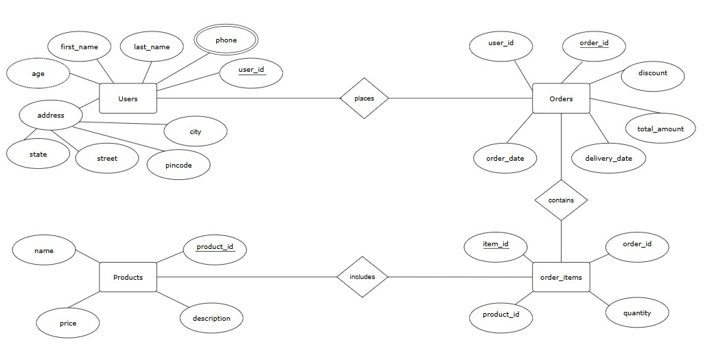

# 🛒 E-Commerce Database Management System (MySQL)

## 📌 Overview
This project is a relational database system designed for an e-commerce platform using MySQL. It demonstrates how data is structured, stored, and analyzed in a real-world scenario.

### Features
- Designed tables for customers, orders, and products
- Inserted sample data to simulate real-world transactions
- Performed SQL operations such as joins, subqueries, and aggregation
---

## 🧠 Objective
The objective of this project is to design and implement a structured relational database for an e-commerce system and use SQL queries to manage and analyze data effectively. It aims to demonstrate practical understanding of database design, relationships, and data-driven insights.

---
## 🛠️ Tech Stack

- **Database:** MySQL
- **Language:** SQL
- **Tools:** MySQL Workbench

---

## 🏗 Database Schema Design

### Entities
- Users
- Products
- Orders
- Order_items

---

## 🔗 ER Relationship

Users → Orders → Order_items → Products

- One User can place multiple Orders  
- One Order can contain multiple Order Items  
- Each Order Item is linked to one Product  

---

## ⚙️ Key Features Implemented

### 🔹 Schema Design
- Normalized relational structure  
- Primary and foreign key constraints  
- Proper entity relationships  

### 🔹 Data Operations (CRUD)
- INSERT operations with sample data  
- UPDATE operations for modifying records  
- DELETE operations for data removal  

### 🔹 SQL Querying
- Filtering using WHERE  
- Sorting using ORDER BY  
- Pagination using LIMIT & OFFSET  

### 🔹 Aggregation & Grouping
- COUNT, SUM, AVG, MAX, MIN  
- GROUP BY with HAVING clause  

### 🔹 Joins
- INNER JOIN across multiple tables  
- Multi-table JOIN for complete order details  

### 🔹 Subqueries
- IN clause subqueries  
- EXISTS subqueries  
- Aggregate-based filtering  

### 🔹 String & Date Functions
- CONCAT, UPPER, LENGTH  
- YEAR, MONTH, DAY  

### 🔹 Schema Evolution
- ALTER TABLE (ADD, MODIFY, RENAME)  

---

## 🧩 Entity Relationship Diagram (ERD)

---

## 🚀 How to Run

1. Open MySQL Workbench or CLI  
2. Execute `schema.sql`  
3. Execute `data.sql`  
4. Run `queries.sql`  

---

## 💡 Notes
- Ensure all SQL files are executed in correct order  
- ER diagram image should be in the same repository folder
- Make sure MySQL server is running before executing queries.

---
